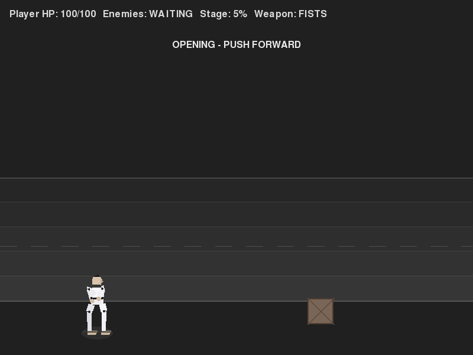

# Quad Fighter Prototype

## Requirements

To run the game, install the required dependencies:

```bash
pip install -r requirements.txt
```

## Controls

- Arrow keys: Move (left/right and up/down lane depth)
- Space: Jump
- Z: Punch / light attack
- X: Kick / heavy attack
- C (hold): Crouch
- C + Z: Crouching punch
- C + X: Crouching kick
- G: Grab (then Z to throw)

### Special Moves

| Move | Input | Description |
|------|-------|-------------|
| **Spin Attack** | Z + X (simultaneously) | Wide spinning strike that hits both sides |
| **Dash Punch** | → + Z while running | Lunge forward with a powered straight punch |
| **Dive Kick** | ↓ + X while airborne | Powerful downward aerial kick |

Special moves deal significantly more damage and knockback than standard attacks.
Their hitboxes are highlighted in **purple** during the strike window.

## Running the Game

```bash
python main.py
```

## Screenshots

### Gameplay Overview


### Combat Hit Feedback


### Level Polish Pass



## Features Implemented

- Side-scrolling stage with camera follow and world-space coordinates
- Player movement with lane-based depth, jump, and two attacks
- Progressive enemy spawning as player advances
- Enemy AI with chase + melee attacks, cooldown pacing, and player damage
- End-of-level boss encounter with distinct silhouette and health bar
- Simple combat system with distinct primary/secondary attack hitboxes and tuning
- Enemy hurt stun, knockback pop, attack windup tells, and brief hit flash feedback
- Interactive environment objects (crates, barrels, and pickup pipe weapon)
- Breakable objects with health and simple break flash effect
- Weapon pickup that boosts attack range/damage for a limited number of hits
- Health food pickups (placed in level and dropped from crates)
- Enemy roster with raider + heavier brawler variants
- Health values and simple HUD (enemy count, stage progress, weapon state)
- Visible lane/floor band for depth readability
- Procedural named-pose fighter animation (idle/walk/jump/attack/hurt)
- 60 FPS game loop
- **Special moves** triggered by simultaneous button combinations:
  - Spin Attack (Z + X): wide bidirectional AoE
  - Dash Punch (→ + Z while running): forward lunge
  - Dive Kick (↓ + X while airborne): powerful downward aerial

## Next Steps

1. Add additional enemy behavior variety
2. Expand player combat options
3. Improve procedural character posing
4. Expand to local co-op
5. Add stage progression
