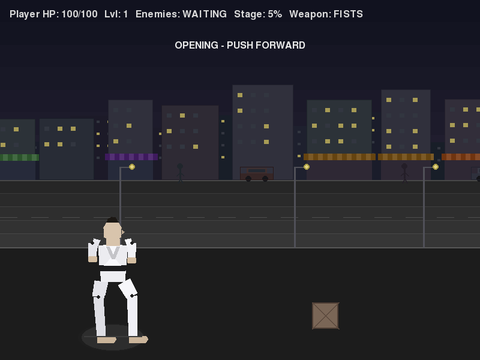
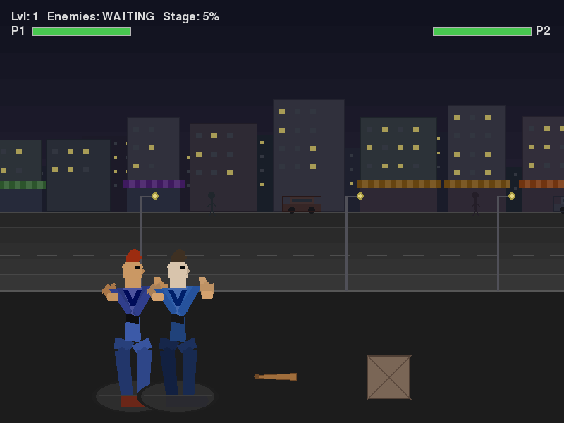
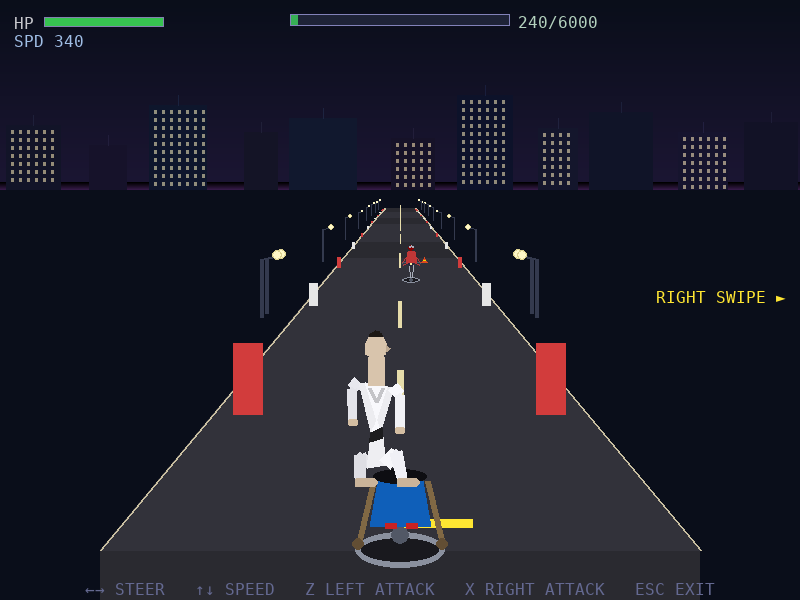
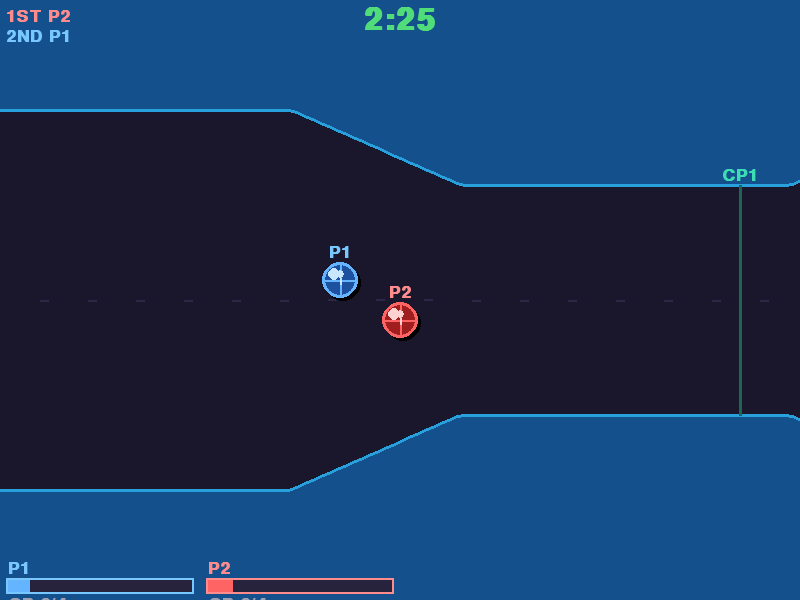

# Quad Fighter

**Quad Fighter** is a side-scrolling arcade beat-em-up built in Python with `pygame-ce`.  
Inspired by classic co-op brawlers like TMNT and Double Dragon, it uses fully procedural vector-style graphics — no bitmap sprites, no asset files.

> **Version 0.4.0** · Python 3.10+ · pygame-ce · numpy

---

## Table of Contents

1. [Installation](#installation)
2. [Running the Game](#running-the-game)
3. [Main Menu](#main-menu)
4. [Game Modes](#game-modes)
   - [Beat-Em-Up (Main Stage)](#beat-em-up-main-stage)
   - [Moto Level](#moto-level)
   - [Rampage Level (Kaiju Mode)](#rampage-level-kaiju-mode)
   - [Gauntlet Mode](#gauntlet-mode)
   - [Pang Mode](#pang-mode)
   - [Rolling Ball Assault Course](#rolling-ball-assault-course)
5. [Controls](#controls)
   - [Beat-Em-Up Controls](#beat-em-up-controls)
   - [Special Moves](#special-moves)
   - [Moto Level Controls](#moto-level-controls)
   - [Rampage Level Controls](#rampage-level-controls)
   - [Gauntlet Mode Controls](#gauntlet-mode-controls)
   - [Pang Mode Controls](#pang-mode-controls)
   - [Rolling Ball Controls](#rolling-ball-controls)
6. [Weapons](#weapons)
7. [Grab & Throw System](#grab--throw-system)
8. [Enemy Types](#enemy-types)
9. [Co-op (Local 2-Player)](#co-op-local-2-player)
10. [Options Screen](#options-screen)
11. [Network Multiplayer](#network-multiplayer)
12. [Running the Server with Docker](#running-the-server-with-docker)
13. [Adding to Steam](#adding-to-steam)
14. [Mac Setup Guide](#mac-setup-guide)
15. [Screenshots](#screenshots)

---

## Installation

Requires **Python 3.10 or later**.

```bash
pip install -r requirements.txt
```

This installs:

| Package | Purpose |
|---------|---------|
| `pygame-ce` | Game window, rendering, and input |
| `numpy` | Procedural audio synthesis |

---

## Running the Game

```bash
python main.py
```

The game runs at **60 FPS** in an **800 × 600** window.  
Version info is printed to the terminal on launch.

---

## Main Menu

The main menu appears on startup with an animated logo.  
Navigate with **↑ / ↓ arrow keys** (or a controller D-pad / left stick) and confirm with **Enter**, **Space**, **Z**, or controller **A button**.

| Menu Item | Description |
|-----------|-------------|
| **Start Game** | Main side-scrolling beat-em-up stage |
| **Moto Level** | Pseudo-3D motorcycle combat level |
| **Rampage Level** | Kaiju-mode city destruction level |
| **Gauntlet Mode** | Co-op top-down dungeon crawl (up to 4 players) |
| **Pang Mode** | Pang / Buster-Bros style co-op ball-busting mode |
| **Rolling Ball** | Timed assault-course race for up to 4 players |
| **Options** | Audio, appearance, key bindings, and network settings |

---

## Game Modes

### Beat-Em-Up (Main Stage)

The core side-scrolling brawler experience.

- Walk right through a **3200px wide scrolling stage** fighting waves of enemies
- Five enemy **spawn zones** trigger as you advance, each with a mix of raider and brawler enemies
- Camera **locks** when a zone activates — all enemies must be defeated before progressing
- A **boss encounter** triggers near the end of the stage with a distinctive silhouette and dedicated health bar
- Break **crates** and **barrels** to reveal food pickups and weapons
- Grab food and weapon pickups from the floor to restore health or arm yourself
- Visual **themes** cycle between levels (Street → Neon → Acid), changing colours for backgrounds, characters, and HUD
- Supports **local 2-player co-op** (see [Co-op](#co-op-local-2-player))

### Moto Level

A forward-perspective pseudo-3D motorcycle chase level.

- The player rides **into the screen** along a curved road with parallax scenery
- **Steer left/right**, **accelerate** and **brake** to dodge obstacles and enemies
- Enemy riders approach from the distance, scale up as they get closer, and must be fought off with swipe attacks
- A **boss biker** appears near the end of the run
- The level ends when you travel the required distance, defeat the boss, or die

### Rampage Level (Kaiju Mode)

A Rampage-inspired city destruction level.

- Pilot a **giant mech suit** across a 2400px cityscape
- **Punch** and **smash** buildings to destroy floor segments — reach 80% destruction to win
- **Climb** buildings for a height advantage
- Fight off waves of **helicopters**, **tanks**, and **planes** that shoot back
- Debris from destroyed floors rains down with physics

### Gauntlet Mode

A co-op top-down dungeon crawl supporting **1–4 players simultaneously**.

- Navigate a multi-room dungeon with corridors and a **locked door**
- **Enemy generators** continuously spawn enemies — destroy all three generators to open the exit
- Pick up a **key** to unlock the door between rooms
- **Food pickups** restore health; health **slowly drains over time** (like the original Gauntlet)
- Wide attack arcs designed for crowd control
- Per-player HP bars and **"NEEDS FOOD BADLY"** warnings

**Players:**
- P1: keyboard
- P2–P4: gamepads (controllers 0–2)

### Pang Mode

A Pang / Buster Bros-inspired co-operative arcade mode.

- Up to **4 players** cooperate on a single screen
- Fire **vertical shots** upward to split and destroy bouncing objects
- Objects split into smaller, faster versions when hit
- Tiny objects (the smallest tier) are destroyed on hit
- Players have **3 lives** each; the round ends when all objects are cleared or all lives are lost

### Rolling Ball Assault Course

A top-down ball racing mode for up to **4 players** simultaneously.

- Each player controls a rolling ball through a **4800px assault course**
- **Accelerate** in any direction to steer your ball down the winding track
- Dodge **spinning bars**, **moving walls**, and **hazard pits** scattered across the course
- **Bumpers** deflect balls — use them strategically or get knocked off course
- **Bounce pads** launch your ball forward for speed boosts
- Pass through **checkpoints** to track progress
- The race ends when the first ball reaches the **finish line**, or after **3 minutes** — furthest ball wins
- Balls can **collide and bounce off** each other, adding tactical chaos to close races
- Fall off the track and you'll **respawn** at the last checkpoint with a brief grace period

---

## Controls

### Beat-Em-Up Controls

#### Player 1 (Keyboard)

| Key | Action |
|-----|--------|
| ← → Arrow keys | Move left / right |
| ↑ ↓ Arrow keys | Move forward / back (lane depth) |
| Space | Jump |
| Z | Punch (light attack) |
| X | Kick (heavy attack) |
| C (hold) | Crouch |
| C + Z | Crouching punch |
| C + X | Crouching kick |
| G | Grab (then Z to throw) |
| Enter | Pause / Start |

#### Player 2 (Keyboard — WASD)

| Key | Action |
|-----|--------|
| A / D | Move left / right |
| W / S | Move forward / back (lane depth) |
| Q | Jump |
| R | Punch (light attack) |
| F | Kick (heavy attack) |
| E (hold) | Crouch |
| T | Grab (then R to throw) |

#### Controller (Xbox layout)

| Button / Stick | Action |
|----------------|--------|
| Left stick / D-pad | Move |
| A | Jump |
| X | Punch (light attack) |
| B | Kick (heavy attack) |
| Y (hold) | Crouch |
| RB | Grab |
| Start / Menu | Pause |

> Controller bindings are fully **rebindable** in the Options screen.

---

### Special Moves

Special moves deal significantly more damage and knockback than standard attacks.  
Their hitboxes are highlighted in **purple** during the active strike window.

| Move | Input | Description |
|------|-------|-------------|
| **Spin Attack** | Z + X simultaneously (on ground) | Wide spinning strike that hits both sides — great for crowds |
| **Dash Punch** | → + Z while at full running speed | Lunge forward with a powered straight punch |
| **Dive Kick** | ↓ + X while airborne | Powerful downward aerial kick |

---

### Moto Level Controls

| Key | Action |
|-----|--------|
| ← → Arrow keys | Steer bike left / right |
| ↑ Arrow key | Accelerate |
| ↓ Arrow key | Brake |
| Z | Left swipe attack |
| X | Right swipe attack |
| Esc / Enter | Exit to menu |

---

### Rampage Level Controls

| Key | Action |
|-----|--------|
| ← → Arrow keys | Move along ground |
| ↑ Arrow key | Climb building / climb higher |
| ↓ Arrow key | Descend building |
| Z | Punch (ground) or strike floor segment (climbing) |
| X | Heavy smash (wider ground attack) |
| Esc / Enter | Exit to menu |

---

### Gauntlet Mode Controls

#### Player 1 (Keyboard)

| Key | Action |
|-----|--------|
| Arrow keys | Move (8-directional) |
| Z | Light attack |
| X | Heavy attack |

#### Player 2–4 (Gamepads)

| Input | Action |
|-------|--------|
| Left stick / D-pad | Move |
| A button | Light attack |
| B button | Heavy attack |

---

### Pang Mode Controls

#### Player 1 (Keyboard)

| Key | Action |
|-----|--------|
| ← → Arrow keys | Move |
| Space | Jump |
| Z | Shoot |

#### Player 2 (Keyboard)

| Key | Action |
|-----|--------|
| A / D | Move |
| Q | Jump |
| R | Shoot |

#### Player 3–4 (Gamepads)

| Input | Action |
|-------|--------|
| Left stick / D-pad | Move |
| A button | Jump / Shoot |

---

### Rolling Ball Controls

#### Player 1 (Keyboard)

| Key | Action |
|-----|--------|
| ← → ↑ ↓ Arrow keys | Roll ball in any direction |
| Esc | Exit to menu |

#### Player 2 (Keyboard)

| Key | Action |
|-----|--------|
| A / D / W / S | Roll ball in any direction |

#### Player 3–4 (Gamepads)

| Input | Action |
|-------|--------|
| Left stick / D-pad | Roll ball in any direction |

---

## Weapons

Weapon pickups are found on the floor or dropped from broken crates and barrels.  
Pick one up by walking over it.  It is automatically equipped and boosts your attack **range** and **damage** for a limited number of hits, then disappears.

| Weapon | Hits | Damage Bonus | Range Bonus |
|--------|------|-------------|-------------|
| **Pipe** | 6 | +8 | +20 |
| **Bat** | 8 | +12 | +28 |
| **Whip** | 10 | +6 | +52 |
| **Chain** | 7 | +10 | +32 |
| **Nunchucks** | 6 | +14 | +18 |

You can also **throw grabbed enemies** at other enemies (see [Grab & Throw](#grab--throw-system)).

---

## Grab & Throw System

Press **G** (or controller **RB**) when near an enemy to grab them.

- While holding an enemy, press **Z** (punch) to **throw** them into other enemies — dealing splash damage on impact
- The enemy will **wriggle free** after a short time if you don't throw
- A short cooldown applies after releasing a grab

> **Tip:** Throwing enemies into groups or walls deals extra damage and triggers a satisfying knockback chain.

---

## Enemy Types

### Main Stage

| Enemy | Description |
|-------|-------------|
| **Raider** | Fast, lightly armoured street fighter — quick attacks, less HP |
| **Brawler** | Heavier enemy with wider attacks, more HP, and greater knockback |
| **Boss** | End-of-level giant with a dedicated health bar, slow windup attacks, and much higher HP |

### Gauntlet Mode

| Enemy | Description |
|-------|-------------|
| **Basic** | Standard grunt — medium speed and damage |
| **Fast** | Small, quick enemy — hard to hit, low HP |
| **Tank** | Slow but tough — resists knockback |
| **Generator** | Stationary spawner — primary objective to destroy |

### Rampage Level

| Enemy | Description |
|-------|-------------|
| **Helicopter** | Fires bullets downward; circles overhead |
| **Tank** | Shoots arcing shells from the ground |
| **Plane** | Drops bombs in a strafing run |

---

## Co-op (Local 2-Player)

The main beat-em-up stage supports **2-player local co-op**:

- **Player 1** uses the keyboard (Arrow keys + Z/X/C/G)
- **Player 2** uses WASD + Q/R/F/E/T, **or** a gamepad plugged in before launching

Both players share the same stage and camera.  The camera tracks the midpoint between both active players.  Enemies target the nearest alive player.

Player 2's fighter uses a **different colour palette** so both characters are easy to tell apart.

---

## Options Screen

Access **Options** from the main menu.  All settings are saved automatically to `settings.json`.

| Section | What You Can Change |
|---------|---------------------|
| **Audio** | Music volume (0–100), SFX volume (0–100) |
| **Appearance** | Player suit colour, hair colour |
| **Keyboard Controls** | Rebind every action for Player 1 keyboard |
| **Controller** | Rebind every action for the gamepad |
| **Network** | Server IP address, server port, Connect button, connection status |

---

## Network Multiplayer

Quad Fighter includes an experimental **headless authoritative TCP server** for online multiplayer.

### Connecting to a Server

1. Open **Options** from the main menu
2. Scroll to the **Network** section
3. Enter the **Server IP** and **Server Port** (default: `127.0.0.1:7777`)
4. Select **Connect** and press Enter

The Status field shows: `Connecting…` → `Connected` (or an error message).

The server version and protocol version are displayed for diagnostics.

### Protocol Notes

- Messages are **newline-delimited JSON over TCP**
- `PROTOCOL_VERSION = 1` — client and server must match
- The client runs on a **background daemon thread** so the game loop always stays at 60 FPS regardless of network latency

---

## Running the Server with Docker

A pre-configured `Dockerfile` and `docker-compose.yml` are included.

### Quick start

```bash
docker compose up -d
```

### Configuration (environment variables)

| Variable | Default | Description |
|----------|---------|-------------|
| `QUAD_SERVER_HOST` | `0.0.0.0` | Listen address |
| `QUAD_SERVER_PORT` | `7777` | TCP port |
| `QUAD_MAX_PLAYERS` | `4` | Maximum simultaneous connections |
| `QUAD_TICK_RATE` | `30` | State broadcasts per second |

### Standalone (no Docker)

```bash
python server.py
# or
QUAD_SERVER_PORT=7777 python server.py
```

### Unraid

An Unraid Community Applications template and icon are provided in the `unraid/` directory.

**Option A – curl the template (recommended)**

SSH into your Unraid server and run:

```bash
curl -L \
  https://raw.githubusercontent.com/julesdg6/quad-fighter/main/unraid/quad-fighter-server.xml \
  -o /boot/config/plugins/dockerMan/templates-user/quad-fighter-server.xml
```

The template will appear immediately under **Docker → Add Container → User Templates** in the Unraid web UI — no reboot required.

**Option B – Community Applications**

1. In the Unraid web UI open **Apps → Community Applications**.
2. Search for **Quad Fighter** or click *Add Container* and paste the template URL:
   ```
   https://raw.githubusercontent.com/julesdg6/quad-fighter/main/unraid/quad-fighter-server.xml
   ```
3. Adjust the port and environment variables as needed and click **Apply**.

The template exposes:

| Setting | Default | Description |
|---------|---------|-------------|
| Game Server Port | `7777` | Host TCP port clients connect to |
| `QUAD_SERVER_PORT` | `7777` | Port inside the container (keep in sync) |
| `QUAD_MAX_PLAYERS` | `4` | Maximum simultaneous connections |
| `QUAD_TICK_RATE` | `30` | State broadcasts per second |

The container image is `ghcr.io/julesdg6/quad-fighter-server:latest`.  
Alternatively build locally with `docker build -t quad-fighter-server .` and set the *Repository* field in the template to `quad-fighter-server`.

---

## Adding to Steam

You can add Quad Fighter to your Steam library as a non-Steam game so it appears in your collection with the correct icon.

### 1. Generate the icon (one-time setup)

```bash
pip install -r requirements.txt   # if not already done
python make_icon.py               # writes icon.png to the game folder
```

### 2. Make the launcher executable (Linux/Mac)

```bash
chmod +x launch.sh
```

### 3. Add to Steam

1. Open Steam → **Games** → **Add a Non-Steam Game to My Library…**
2. Click **Browse**, navigate to the `quad-fighter` folder, select `launch.sh`, and click **Add Selected Programs**.
3. In your library, right-click **launch.sh** → **Properties**.
4. Set the **Name** to `Quad Fighter`.
5. Next to **Shortcut**, click the default icon box, then **Browse** and select `icon.png` from the game folder.
6. Close Properties — Quad Fighter will now appear in your library with the custom icon.

> **Note:** The launcher (`launch.sh`) auto-detects a local `.venv` or `venv` virtual environment, otherwise it falls back to the system `python3`.

---

## Mac Setup Guide

For a step-by-step guide to setting up Quad Fighter on macOS (including installing Python, VS Code, and dependencies), see **[MAC_SETUP.md](MAC_SETUP.md)**.

---

## Screenshots

### Gameplay Overview



### Combat Hit Feedback



### Moto Level



### Rolling Ball Assault Course


